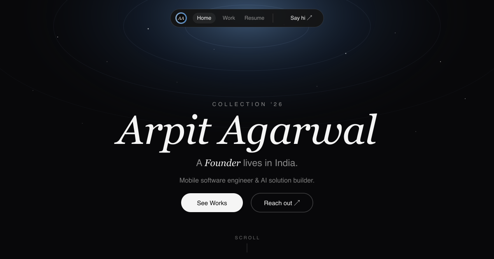

<p align="center">
  
</p>

<p align="center">
  <a href="https://arpitagarwal1301.github.io"></a>
  <a href="https://github.com/arpitagarwal1301/arpitagarwal1301.github.io/actions/workflows/deploy.yml"></a>
  
  
</p>

> A dark, editorial single-page portfolio — built once, configured from one file.

A single-page portfolio for a mobile software engineer & AI solution builder. Cinematic HLS video hero, GitHub-driven project cards, and scroll-driven motion — with all content living in one config file.

## Highlights

- 🎬 **Cinematic hero** — full-screen HLS video background with a GSAP entrance and a cycling role line.
- 🗂️ **GitHub-driven work** — project cards and a recent-projects list pull straight from repos; private/unreachable repos fall back gracefully to a placeholder and the GitHub profile.
- ⚙️ **One-file config** — name, links, copy, projects, and stats all live in [`src/lib/content.ts`](src/lib/content.ts); the browser tab title and favicon are generated from it at runtime.
- 🎞️ **Motion** — Framer Motion scroll reveals, GSAP timelines, and a footer marquee.
- 📱 **Responsive, forced-dark** — Tailwind design tokens tuned from mobile to desktop.
- 🚀 **Zero-touch deploy** — push to `main` and GitHub Actions ships it to Pages.

## Tech stack

React 18 · Vite 6 · TypeScript · Tailwind CSS v3 · GSAP · Framer Motion · hls.js · React Router

## Develop

```sh
npm install
npm run dev      # http://localhost:5173
npm run build    # type-check + production build → dist/
```

## Make it yours

Edit the `config` block at the top of [`src/lib/content.ts`](src/lib/content.ts) — name, location, email, socials, projects, and stats. Everything (including the tab title and favicon) updates from there.

## Deploy

Every push to `main` triggers [`.github/workflows/deploy.yml`](.github/workflows/deploy.yml), which builds the app and publishes `dist/` to GitHub Pages.
